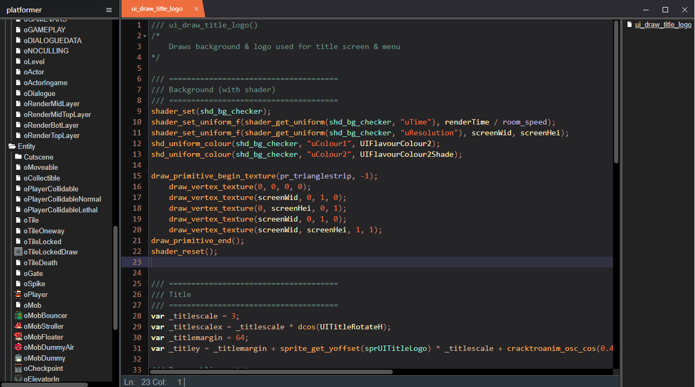
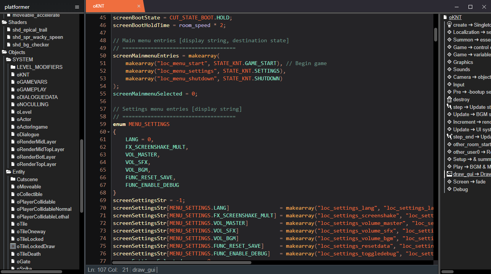
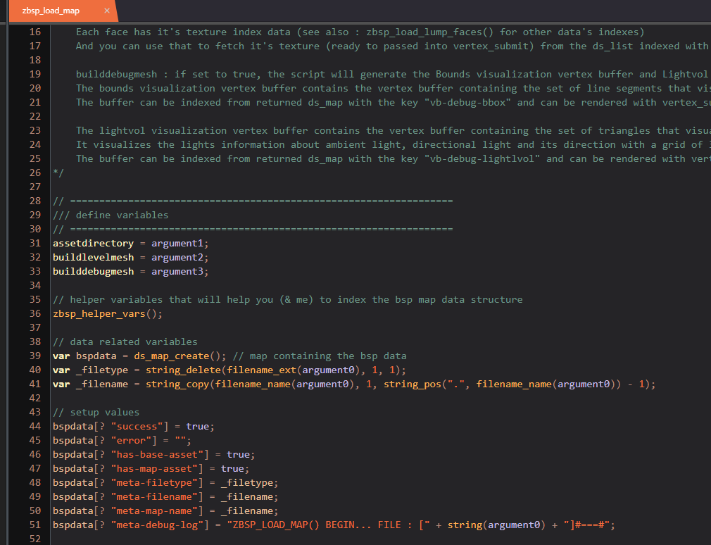
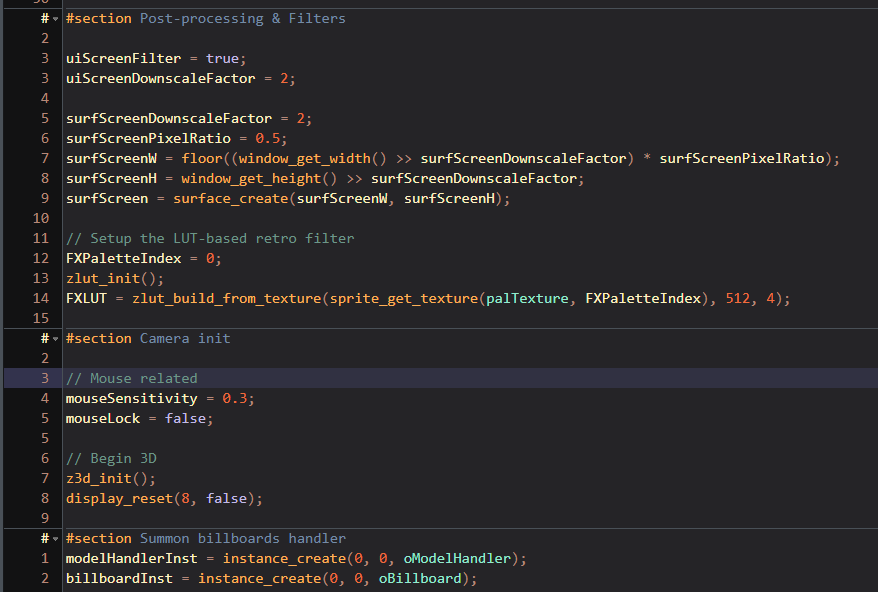

`vinyot_speeb.css`; A (relatively lame) theme for [GMEdit](https://yellowafterlife.itch.io/gmedit)
===
This theme was built by me for personal use out of boredom back in 2019, July. Because of that the theme was/will be rarely maintained.

Gallery
===





Install
===
* In the GMEdit, Open the `Menu > Preferences`
* On the sidemenu that appears, Click the `manage` on the `Theme` section.
* Place the theme folder `vinyot_speeb` into the folder that has just opened
* The final directory should resemble something like this :
```
...themes\
    + vinyot_speeb\
        > config.json
        > tree.png
        > vinyot_speeb.css
```
* Restart GMEdit, On the same Theme menu `vinyot_speeb` should be available for selection now.